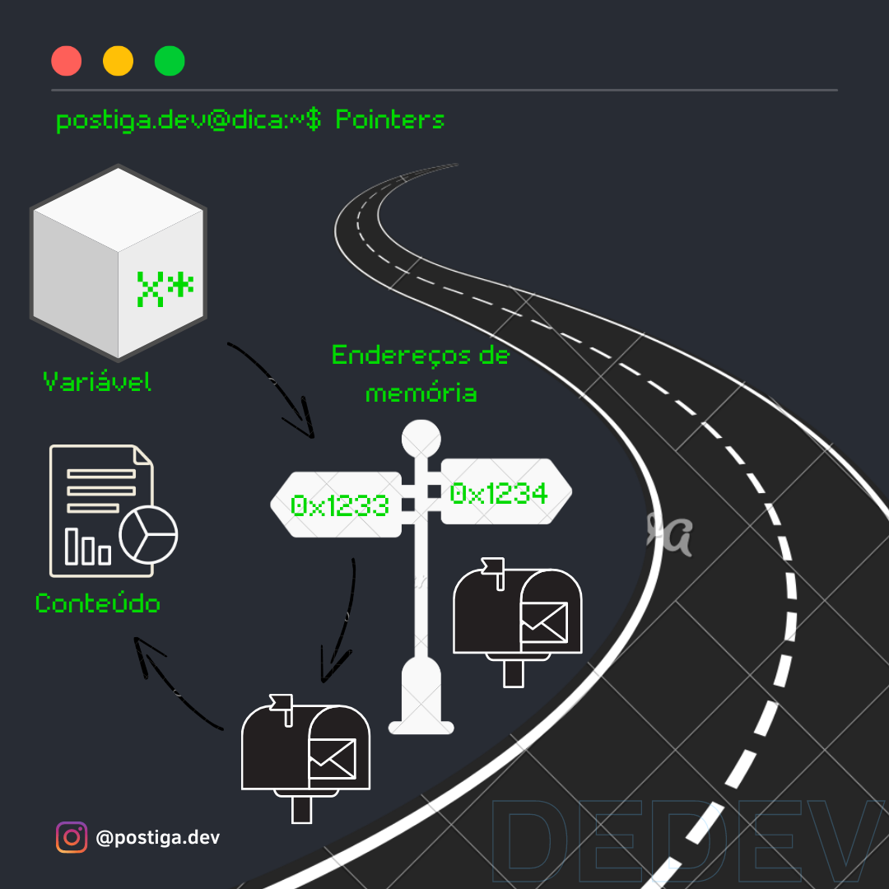
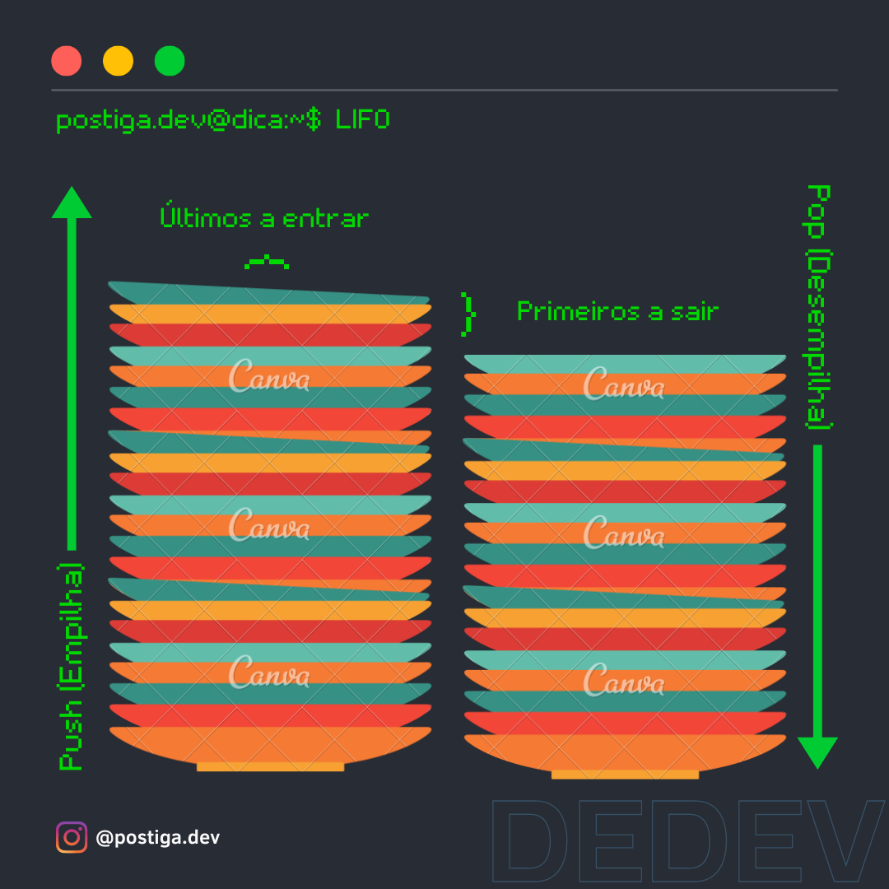

# Ponteiros, o que são e para que servem?

Muito presentes no dia a dia de programadores que utilizam linguagens como C, C++ e recentemente Go, ponteiros são um conceito fundamental da computação que deve estar no repertório de todo programador que quer tornar seus códigos eficientes computacionalmente.

Ponteiros são variáveis que armazenam endereços de memória, que podem conter: dados, funções, instruções ou qualquer coisa que dê para armazenar em bits dentro da memória do computador. Geralmente os ponteiros são utilizados pela sua eficiência no consumo de memória em tempo de execução e também para tornar a códigos mais genéricos e dinâmicos ao tipo, pois conseguem "apontar" para valores de variáveis de tipo específico ou genérico.

<figure><figcaption>
Ilustração do uso de ponteiros
</figcaption></figure>

Conhecer este conceito é fundamental para se tornar um programador eficiente, eles serão muito utilizados por você em linguagens que o implementam de forma explícita, e também, em linguagens que fazem um uso mais indireto deste conceito, abstraindo sua complexidade em por exemplo: callbacks, function pointers, variáveis passadas por referência, uso do operador **new** para criar objetos, entre outros.

Provavelmente você já utiliza ponteiros todos os dias, seja manipulando e acessando diretamente como fazemos em C, C++ ou Go, ou manipulando referências por baixo dos panos como em C#, Python, Java e etc.

O objetivo deste artigo é mostrar para você pontos que geralmente passam desapercebidos durante o dia a dia de desenvolvimento, e cenários em que você pode utilizar estes conceitos ao seu favor.

## Contextualizando: Stack e Heap

Antes de entrar no assunto de ponteiros, para um melhor entendimento, precisamos contextualizar Stack e Heap.

Stack, ou pilha, em portugês, é uma estrutura de dados muito conhecida e utilizada no mundo da computação, ela segue a política LIFO (Last IN First OUT) que pode ser comparada à analogia da pilha de pratos, onde, o primeiro prato a entrar é sempre o último a sair, e, o último a entrar é sempre o primeiro a sair LIFO.

<figure><figcaption>
Ilustração funcionamento da pilha de pratos
</figcaption></figure>

